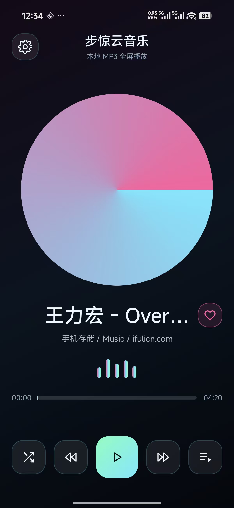
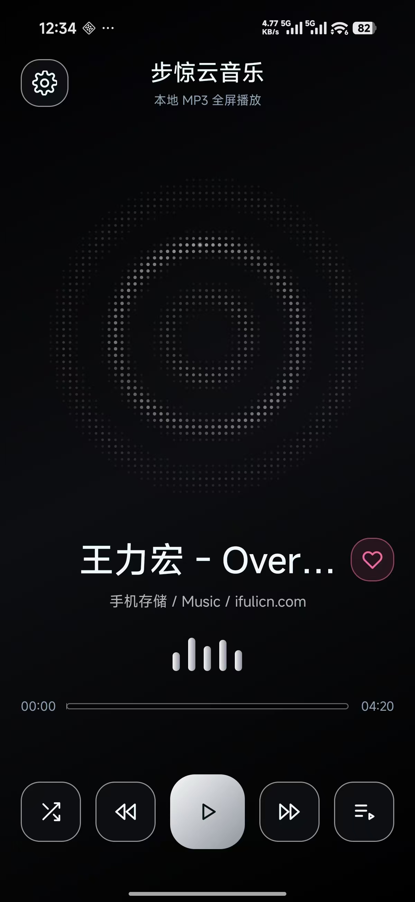
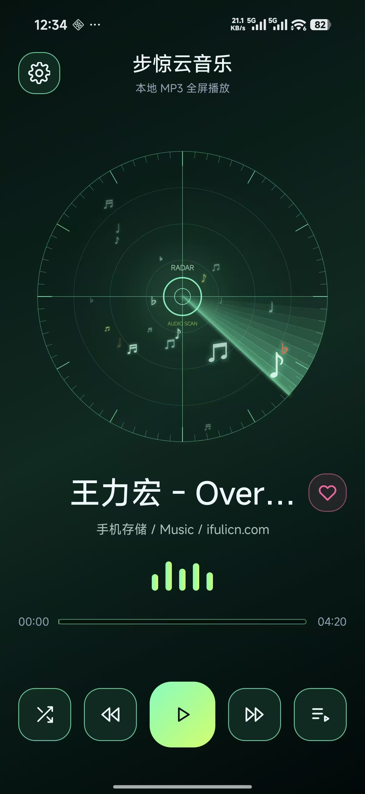

# NovaPulse MP3

NovaPulse MP3 是一个原生 Android 本地音乐播放器。当前实现围绕全屏播放器、手机音频扫描、目录选择、收藏歌单和三套动态 UI 样式展开，适合继续扩展成个人离线音乐播放器或 Android UI 原型工程。

## 预览

| 霓虹 | 波纹 | 雷达 |
| --- | --- | --- |
|  |  |  |

三套样式资源已放在 `android-design/` 目录：

- `霓虹`：默认播放器视觉，黑底霓虹、旋转唱片和动态频谱条。
- `波纹`：中心扩散波纹视觉，播放时随状态变化动效。
- `雷达`：雷达扫描视觉，带环形网格、扫描光束和音符目标点。

## 已实现功能

- 本地音频播放：使用 Android `MediaPlayer` 播放扫描到的音频 URI。
- 系统曲库扫描：通过 `MediaStore` 读取手机公共音频库，兼容 Android 13+ 的 `READ_MEDIA_AUDIO` 权限和旧版本 `READ_EXTERNAL_STORAGE` 权限。
- 自定义目录读取：通过系统目录选择器选择音乐目录，并递归扫描子目录中的常见音频文件。
- 播放控制：支持播放/暂停、上一首、下一首、随机播放、列表循环和单曲循环。
- 播放进度：显示已播放时间和总时长，支持拖动进度条跳转。
- 收藏管理：可收藏/取消收藏歌曲，收藏状态通过 `SharedPreferences` 持久化。
- 歌单面板：支持查看全部音乐、收藏音乐，并从全部列表或收藏列表开始播放。
- 收藏队列：从收藏列表播放时，上一首/下一首会优先在收藏队列中切换。
- 动态视觉：播放时启用唱片旋转、频谱条动画、波纹或雷达可视化。
- UI 样式切换：内置 `霓虹`、`波纹`、`雷达` 三种样式，并持久保存用户选择。
- 音频焦点处理：来电、其他 App 抢占音频焦点时自动暂停或恢复。
- 媒体会话：接入 `MediaSession`，支持系统媒体控制的播放、暂停、上一首和下一首。
- 全屏适配：处理状态栏、导航栏和底部安全区域。

## 工程结构

```text
.
├── app/
│   ├── build.gradle
│   └── src/main/
│       ├── AndroidManifest.xml
│       ├── java/com/novapulse/mp3/
│       │   ├── MainActivity.java
│       │   └── ThemeVisualizerView.java
│       └── res/
│           ├── drawable/
│           ├── layout/activity_main.xml
│           ├── mipmap-*/
│           └── values/
├── android-design/
│   ├── README.md
│   ├── 霓虹.jpg
│   ├── 波纹.jpg
│   ├── 雷达.jpg
│   └── res/
├── dist/
│   └── NovaPulse-debug.apk
├── build.gradle
├── settings.gradle
└── gradlew
```

## 运行环境

- Android Studio
- Android Gradle Plugin 工程
- Compile SDK: 35
- Min SDK: 23
- Target SDK: 35
- 开发语言：Java

## 构建与运行

使用 Android Studio：

1. 打开当前仓库目录。
2. 等待 Gradle 同步完成。
3. 连接 Android 手机或启动模拟器。
4. 运行 `app`。
5. 首次进入后授予音频读取权限。

使用命令行构建：

```bash
./gradlew assembleDebug
```

构建产物通常位于：

```text
app/build/outputs/apk/debug/app-debug.apk
```

仓库中也保留了一份已打包的 debug APK：

```text
dist/NovaPulse-debug.apk
```

## 使用说明

1. 首次打开 App 后，授权读取本机音频。
2. App 会优先扫描系统公共音频库。
3. 如需指定目录，进入设置面板，点击“选择音乐目录”。
4. 在播放器底部控制区切换播放模式、播放上一首/下一首或打开歌单。
5. 在歌单面板中切换“全部音乐”和“收藏音乐”。
6. 在设置面板中切换 `霓虹`、`波纹`、`雷达` 三种 UI 样式。

## 支持的音频识别类型

目录扫描会识别常见音频 MIME 类型，并按扩展名兜底匹配：

```text
mp3, m4a, aac, wav, wave, flac, alac, aif, aiff, ogg, oga, opus, amr, 3gp, wma
```

## 设计资源

`android-design/` 是面向 Android Studio 的设计稿资源目录，包含独立的布局、颜色、图标和背景 XML，可作为 UI 对照或复用素材。

其中三张样式图对应当前 App 内已实现的 UI 样式：

- `android-design/霓虹.jpg`
- `android-design/波纹.jpg`
- `android-design/雷达.jpg`

`android-design/res/` 中的资源保留了早期设计稿结构，可与 `app/src/main/res/` 对照查看。

## 当前限制

- 目前是单 Activity 原生实现，尚未拆分 ViewModel 或数据层。
- 播放列表来自系统扫描或用户选择目录，暂未接入歌词、封面解析和在线音乐源。
- 设置面板中的部分开关仍偏 UI 展示，核心可用逻辑集中在目录选择、主题切换和播放控制。

## License

暂未声明开源许可证。如需公开复用，请先补充明确的 License。
